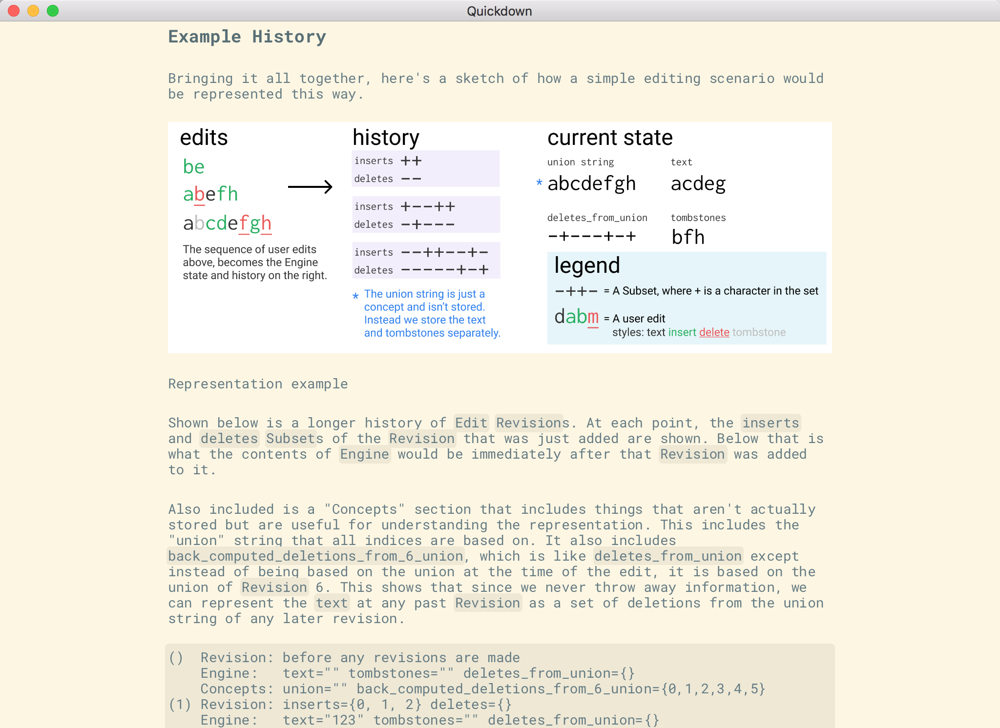
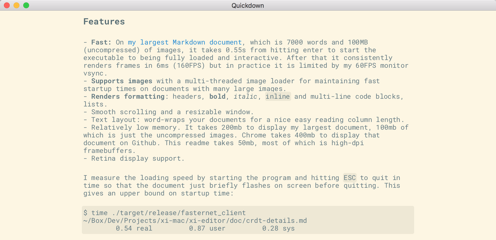

# Quickdown

Quickdown is a fast lightweight cross-platform markdown viewer, for now. It was my project for Hack the North 2017. It's written in Rust and uses Webrender for efficient GPU rendering of large text documents.

It was originally intended to be something much more ambitious, but I had to scale down my ambitions due to time constraints. See the "Background" section.



## Features

- **Fast:** On [my largest Markdown document](https://github.com/google/xi-editor/blob/master/doc/crdt-details.md), which is 7000 words and 100MB (uncompressed) of images, it takes 0.55s from hitting enter to start the executable to being fully loaded and interactive. After that it consistently renders frames in 6ms (160FPS) but in practice it is limited by my 60FPS monitor vsync.
- **Supports images** with a multi-threaded image loader for maintaining fast startup times on documents with many large images.
- **Renders formatting**: headers, **bold**, *italic*, `inline` and multi-line code blocks, lists.
- Smooth scrolling and a resizable window.
- Text layout: word-wraps your documents for a nice easy reading column length.
- Relatively low memory. It takes 200mb to display my largest document, 100mb of which is just the uncompressed images. Chrome takes 400mb to display that document on Github. This readme takes 50mb, most of which is high-dpi framebuffers.
- Retina display support.

I measure the loading speed by starting the program and hitting `ESC` to quit in time so that the document just briefly flashes on screen before quitting. This gives an upper bound on startup time:

```
$ time ./target/release/fasternet_client ~/Box/Dev/Projects/xi-mac/xi-editor/doc/crdt-details.md
        0.54 real         0.87 user         0.28 sys
```

## What I did

1. Write a font loader and basic style system on top of Webrender.
1. Render text from a simple document model.
1. Write a word-wrapping and text layout implementation.
1. Use a Markdown parser library to load Markdown files into my document model.
1. Render the wrapped paragraphs of the document model linearly on screen.
1. Add support for smooth scrolling.
1. Add fancy rounded rectangle backgrounds for inline and multi-line code blocks.
1. Add support for loading images, with a multi-threaded loader.
1. Render images inline with the page, scaling them to fit neatly in the document.

## Limitations

Seeing as this was done at a hackathon with very limited time, there's a number of limitations:

- Links show up in color but can't be clicked, because I didn't write an interaction framework.
- Only supports monospace fonts. I didn't have time to integrate Harfbuzz or kerning and without that non-monospace fonts look crappy.
- Doesn't support all Markdown constructs. Only the most popular ones.
- Command line interface is unfriendly and will crash if you do things like reference images which don't exist.

## Background

This was originally intended to be a prototype of a fast document browser
that rendered with webrender and fetched documents using an efficient compressed
network protocol that required one round trip to fetch a page. Hence the name of the crates.

This would allow aggressive prefetching and fast rendering, hopefully hitting
the target of displaying the next page the frame after you clicked a link.

Unfortunately, this was overly ambitious, as I realized an hour or two into
the hackathon. So I scaled back my ambitions to just making a fast markdown viewer.
So that's what this is for now.

## Meta Screenshot


